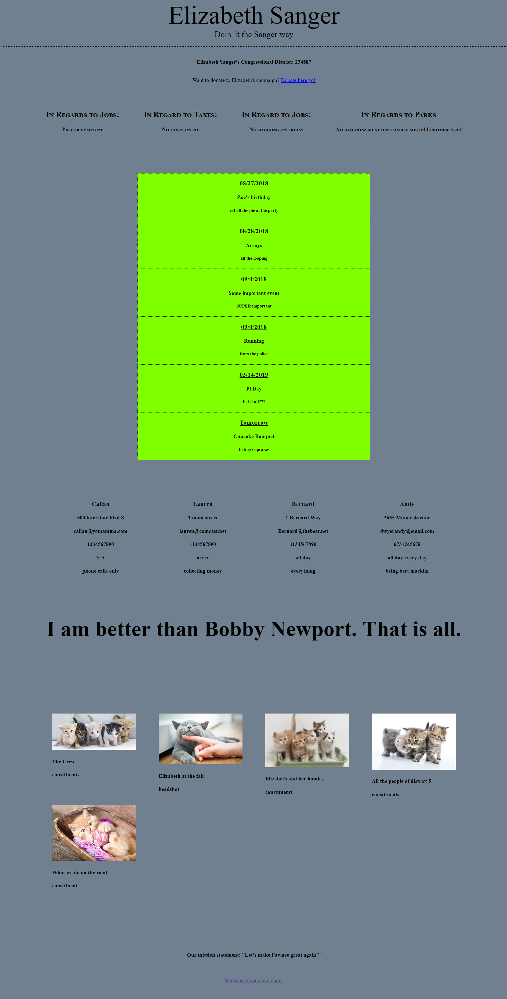

# JavaScript Arrays and Objects - the Elizabeth Sanger Project

This was a challenge to create arrays and objects! In class we learned about arrays and objects, wrote some together and then was given the challenge to create. The challenge itself asked us to take information written for us (objects within arrays) and print those to the dom. We had to learn how to write HTML directly into JS, using an div to tie it to. We learned how to also write string builders. After we did the first initial printing, we were asked to go in and make changes via writing a new function. 

# Screenshot



# How to run this project

1. Use npm to install http-server in your terminal if you have not already:
```
npm install -g http-server
```

2. Run the server: 
```
hs -p 9999
```
3. Open Chrome and navigate to:
```
localhost:9999
```